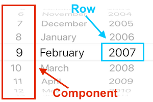

# PickL


[](https://swift.org/)
[](https://github.com/Carthage/Carthage)
[](http://cocoadocs.org/docsets/PickL)
[](http://makeapullrequest.com)

**PickL** is an elegant manager to easily deal with `UIPickerView`. You don't have to implement a logic for `UIPickerViewDataSource` and `UIPickerViewDelegate` by yourself anymore, it's already done under the hood.


## Usage 🚀

`PickL` is the main object, it frees you from a directly work with **delegate** and **datasource**. 

```swift
PickL<StringAdaptor>(pickerView: pickerView)
```

Due to some `UIPickerView` restrictions, you can't work with ***view*** and ***string*** representable items simultaneously in one picker view. So you have to point out an adapter: `StringAdaptor` or `ViewAdaptor` 🔌.

### Component items / row items
A bit of terminology - image below explains everything that you need to understand the future explanations. 



**🔬 Let's dive in:**

1. You have a few ways of creating a *row item*.

	**String representable.** There's an extension for `NSAttributedString` and `String` for convenient row item initializing:
	
	```swift
	let rowItem = NSAttributedString(string: "Nikita", attributes: [NSAttributedStringKey.foregroundColor: UIColor.red])

	let rowItems: [RowStringItemProtocol] = ["Nikita", "Artem"]
	```
	
	or a directly inheritance from `RowStringItemProtocol`:
	
	```swift
	/// In this case you have a `didSelectHandler`.
	let rowItem1 = RowStringItem(title: "Nikita")
	let rowItem2 = RowAttributedStringItem(attributedTitle: NSAttributedString(string: "Artem"))
	```
	
	```swift
	class CustomRowItem: RowStringItemProtocol {
	    let name: String
	
	    init(name: String) {
	        self.name = name
	    }
	    
	    func pickerView(_ pickerView: UIPickerView, titleForRow row: Int, forComponent component: Int) -> String? {
	        return name
	    }
	}
	```
	
	And the similar approach for **view representable:**
	
	```swift
	let rowItem1 = UIView(title: "Nikita")
	let rowItem2 = UIView(title: "Artem")
	```

	```swift
	class CustomRowItem: RowViewItemProtocol {
	    
	    func pickerView(_ pickerView: UIPickerView, viewForRow row: Int, forComponent component: Int, reusing view: UIView?) -> UIView {
	        return UIView() /// return custom view
	    }
	}
	```

2. Then using these row items create a *component item*.

	```swift
	let componentItem = ComponentItem<StringAdaptor>(rowItems: [rowItem1, rowItem2])
	```

3. And finally you need to install this component.
	
	```swift
	let pickL = PickL<StringAdaptor>(pickerView: pickerView)
	pickL.components = [componentItem]
	```
	
### A bit more about component item.

Component items provides a plenty of selection approaches:

 * `selectRow(_ row: Int, animated: Bool)`
 * `selectNextRow(animated: Bool, checkIndexOutOfRange: Bool, isLoopEnabled: Bool)`
 * `selectPreviousRow(animated: Bool, checkIndexOutOfRange: Bool, isLoopEnabled: Bool)`
 * `selectFirstRow(animated: Bool)`
 * `selectLastRow(animated: Bool)`
	
### Detecting row selection 👀

 User has a few ways for detecting a row selection:

* Each row item that is inherited from `RowStringItem`, `RowAttributedStringItem` or directly from `RowItem` has a callback with passed **row index** and **component index** - useful when you want to monitor a selection for some specific item:

	```swift
	rowItem.didSelectHandler = { rowIndex, componentIndex in
		// Place for advertisement 🙈
	}
	```

* If you don't want to follow the changes for some specific row item, it's also possible to observe a row selection directly from a component:

	```swift
	componentItem.didSelectRowHandler = { componentItem, rowIndex, rowItem in
		print("💃 💃 💃")
	}
	```
	
	or directly get a selected row item: `componentItem.selectedRowItem `


* To the last, user has the ability to detect all row selection in each component just in one callback:

	```swift
	pickL.selectedRowsHandler { rowIndex1, rowIndex2, ... in
		print("\(rowIndex1), \(rowIndex2)")
	}
	```
	
	or use an array of all selected rows:
	
	```swift
	print(pickL.selectedRows) // [0, 1]
	```
	
	### 🙋‍♂️ Note: This callback has up to 7 passed parameters (row indexes).
	
	**Even if you have more than 7 component items, there is a general solution:**
	
	```swift
	pickL.selectedRowsArrayHandler { selectedRows in
        print(selectedRows)
    }
	```

## Installation

#### Carthage
Create a `Cartfile` that lists the framework and run `carthage update`. Follow the [instructions](https://github.com/Carthage/Carthage#adding-frameworks-to-an-application) to add the framework to your project.

```
github "rosberry/PickL"
```

#### CocoaPods
You can use [CocoaPods](http://cocoapods.org/) to install `PickL` by adding it to your `Podfile`:

```ruby
platform :ios, '12.0'
use_frameworks!
pod 'PickL'
```
#### Manually

Drag `Sources` folder from [last release](https://github.com/rosberry/PickL/releases) into your project.

## Authors 

* [Nikita Ermolenko](https://github.com/Otbivnoe), nikita.ermolenko@rosberry.com

## About


This project is owned and maintained by [Rosberry](http://rosberry.com). We build mobile apps for users worldwide 🌏.

Check out our [open source projects](https://github.com/rosberry), read [our blog](https://medium.com/@Rosberry) or give us a high-five on 🐦 [@rosberryapps](http://twitter.com/RosberryApps).

## License

**PickL** is available under the MIT license. See the LICENSE file for more info.
